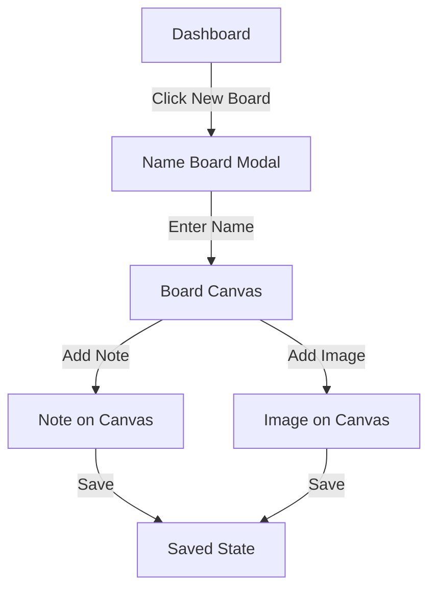

# Extract IA and Flows - Reference

## Example: Board App Sitemap

```markdown
# Sitemap - MindCraft Board App

## Public
- `/` - Landing page with hero, features, pricing
- `/login` - Email/password or OAuth
- `/signup` - Account creation
- `/forgot-password` - Password reset flow

## Authenticated
- `/dashboard` - List of user's boards (default after login)
- `/board/:id` - Board canvas (main workspace)
- `/board/:id/share` - Share settings modal/page
- `/templates` - Pre-made board templates
- `/profile` - User profile and preferences
- `/settings` - Account settings, billing, integrations

## Navigation
- **Top Bar**: Logo (→ dashboard), Search boards, New Board button, Profile menu
- **Board Canvas**: Back to dashboard, Board title (editable), Share, Settings
- **Mobile**: Hamburger menu for global nav, swipe gestures for board navigation
```

## Example: User Flow

```markdown
### Flow: Create and Populate First Board

**Persona**: New user (solopreneur planning a project)
**Trigger**: User clicks "New Board" after signup

**Steps**:
1. Dashboard → Click "New Board" button
2. Modal appears: "Name your board" input field
3. User enters "Home Renovation Project" → Click "Create"
4. Navigate to `/board/abc123` (empty canvas)
5. Onboarding tooltip: "Add your first note by clicking the + button"
6. User clicks toolbar → "Text Note"
7. Note appears on canvas, user types "Budget: $50k"
8. User drags note to position, resizes
9. User adds image (upload or URL)
10. User adds checklist with tasks
11. User clicks "Save" (or autosave indicator shows)
12. Success: Board is saved, user can continue or return to dashboard

**Success Criteria**:
- Board created with unique ID
- At least one item added to canvas
- Items persist after page reload

**Error Scenarios**:
- Upload fails → Show retry button with error message
- Network lost during save → Queue changes, sync when reconnected
- Browser closes → Autosave prevents data loss
```

## Example: Navigation Model

```markdown
## Navigation Patterns

### Global Navigation (All Screens)
- **Desktop**: Horizontal top bar, always visible
  - Left: Logo (→ dashboard), Search
  - Right: New Board, Notifications, Profile dropdown
- **Mobile**: Collapsible hamburger menu
  - Logo, Search, New Board, Profile

### Contextual Navigation
- **Breadcrumbs**: Dashboard > Board Name > Settings
- **Back Button**: On detail/settings pages
- **Tabs**: Within settings (Account, Billing, Integrations)

### Deep Linking
- `/board/:id` - Direct link to specific board
- `/board/:id?item=:itemId` - Link to specific item on board
- `/templates/:templateId` - Link to template preview

### Keyboard Shortcuts
- `Cmd/Ctrl + K` - Quick search
- `Cmd/Ctrl + N` - New board
- `Esc` - Close modals/cancel actions
- `Space` - Pan mode (on canvas)
```

## IA Extraction Checklist

### From Product Spec, Extract:
1. **User Roles**: Who uses the product? (admin, user, guest, etc.)
2. **Core Features**: What are the main capabilities?
3. **Data Entities**: What objects/resources exist? (boards, notes, users, etc.)
4. **CRUD Operations**: Create, Read, Update, Delete for each entity
5. **Relationships**: How entities connect (board has many notes, user owns boards)
6. **Access Control**: Who can do what? (public/private boards, sharing)
7. **Integrations**: External services mentioned (OAuth, file storage, etc.)

### Sitemap Structure Tips
- **Flat is better than deep**: Aim for 2-3 levels max
- **Consistent patterns**: List → Detail → Edit (standard CRUD)
- **Logical grouping**: Related screens under same parent
- **Clear naming**: Use verbs for actions, nouns for resources

### Flow Documentation Tips
- **Start with trigger**: What initiates the flow?
- **Number steps**: Makes it easy to reference
- **Show decisions**: If/else branches clearly marked
- **Include happy path and errors**: Don't just document success
- **Define completion**: What does "done" look like?

## Common Flow Patterns

### Onboarding Flow
```
Signup → Email Verification → Profile Setup → Tutorial/Tour → Dashboard
```

### CRUD Flow (e.g., Board Management)
```
List View → Create New → Edit → Save → Back to List
          ↓
       View Detail → Delete (with confirmation)
```

### Sharing Flow
```
Item Detail → Click Share → Enter Email/Generate Link → Set Permissions → Send/Copy → Confirmation
```

### Error Recovery Flow
```
Action Fails → Error Message → Retry Button → Success
                            ↓
                        Help Link → Support/Docs
```

## Tools for Visualization

### Sitemap Tools
- **Figma/FigJam**: Visual sitemap with boxes and arrows
- **Miro**: Collaborative sitemap building
- **Whimsical**: Quick sitemap diagrams
- **Markdown + Mermaid**: Text-based diagrams

### Flow Diagrams


## Integration with Screen Inventory

After extracting IA and flows, the screen inventory builder will:
1. Take each screen from sitemap
2. Reference flows to understand screen purpose
3. Define inputs/outputs based on flow steps
4. Identify states (loading, empty, error) from error scenarios
5. Map navigation based on flow transitions

This creates a complete foundation for UI prompt generation.
